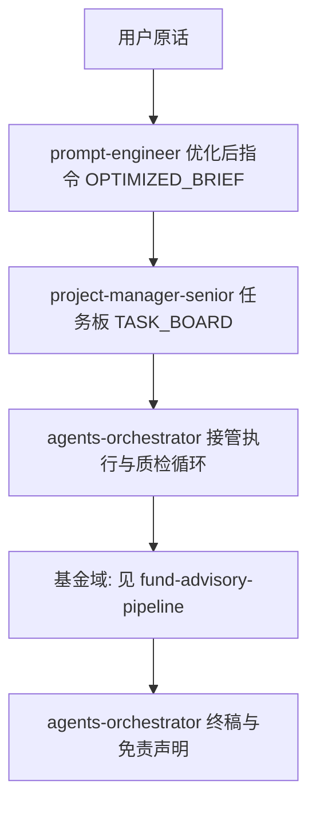

# Agency 运行模型（agency-agents-zh 原文角色｜本项目适配）

> **智能体来源**：`.cursor/agents/` 内对应 `.md` 均为 [agency-agents-zh](https://github.com/jnMetaCode/agency-agents-zh) **原文拷贝**。更新：`scripts/sync-agency-agents.ps1`。  
> 本文件描述 **三层治理 + 域流水线**；人设正文以上游为准。

## 0. 运行日目录与指标工作簿（必选）

1. **流水线开始前**：必须在仓库根创建当日目录 **`data/YYYY-MM-DD/`**（「运行日」，一般为自然日）。可用 `scripts/new-data-run-folder.ps1`，或由 `cn-fund persist-run` 在写入时自动创建父目录。  
2. **指标终稿（表格）**：工程事实层的「基金指标宽表」须写入同一目录下的 **`fund_metrics_runs.xlsx`**。  
3. **同一天多次输出**：每次保存 **追加一个新工作表（Sheet）**，命名为 `Run_001`、`Run_002`…（自动递增），**禁止覆盖**已有 Sheet。  
4. **推荐输入**：  
   - **手工表**：JSON（含 `fund_nav_as_of`、`topic`、`rows`）→ `cn-fund persist-run --date YYYY-MM-DD --json path/to/table.json`  
   - **自动拉数**：mapping（`topic` + `funds[{code,板块,简称}]`）→ `cn-fund persist-auto --date YYYY-MM-DD --mapping path.json`（简称可空，自动查名录）

Markdown 报告（`01_*.md` 等）可与 `.xlsx` 并存于同一日期目录。

## 角色总览

| 层级 | `.cursor/agents/` 文件 | 上游路径 | 在本项目中的职责 |
|------|-------------------------|----------|------------------|
| **输入网关** | `prompt-engineer.md` | `specialized/prompt-engineer.md` | 将用户自然语言 **重写为可执行指令**（目标/约束/交付物/验收标准） |
| **任务治理** | `project-manager-senior.md` | `project-management/project-manager-senior.md` | **拆规格、列任务、指派执行智能体、跟踪范围** |
| **执行编排** | `agents-orchestrator.md` | `specialized/agents-orchestrator.md` | **协调各 Agent 交接**、质量循环、阶段门禁与合成输出 |
| **域执行（基金）** | 见下表 | — | 由编排者按 `workflows/fund-advisory-pipeline.md` 调度 |

**基金域执行角色**（仍均为上游原文）：

| 文件 | 上游路径 |
|------|----------|
| `engineering-data-engineer.md` | `engineering/engineering-data-engineer.md` |
| `marketing-daily-news-briefing.md` | `marketing/marketing-daily-news-briefing.md` |
| `finance-investment-researcher.md` | `finance/finance-investment-researcher.md` |
| `testing-reality-checker.md` | `testing/testing-reality-checker.md` |
| `legal-compliance-checker.md`（可选） | `support/support-legal-compliance-checker.md` |

## 推荐执行顺序（全链路）

### 1. 输入网关（必选，可例外）

- 输出物：**`OPTIMIZED_BRIEF`**（自然语言或 Markdown 列表均可，须可交给 PM 直接拆任务）。
- **例外**：用户以「**免优化**」开头或明确声明不经过提示词改写时，跳过本步，原话即 `OPTIMIZED_BRIEF`。

### 2. 项目经理

- 输入：`OPTIMIZED_BRIEF` + 仓库现状（如已有 `DATA_FACTS` 等）。
- 输出：**`TASK_BOARD`**：任务 ID、负责智能体（用上游 **name** 或文件名指称）、依赖关系、完成定义（DoD）、优先级。
- 指派示例：`engineering-data-engineer` → 跑 `cn-fund`；`marketing-daily-news-briefing` → 要闻；`finance-investment-researcher` → 研究备忘录；`testing-reality-checker` → 现实检验。

### 3. 智能体编排师（agents-orchestrator）

- 输入：`TASK_BOARD`。
- 行为：按 PM 拆分的顺序 **派发上下文**、强制执行 **开发/域执行 ↔ 质检** 式循环（本项目域内即：事实/新闻 → 研究 → `testing-reality-checker`）、汇总 **`FINAL_DELIVERABLE`**。
- 基金域内的具体并行与 JSON 交接字段仍遵守 **`workflows/fund-advisory-pipeline.md`**。

### 4. 基金域（嵌套）

编排者触发 **`workflows/fund-advisory-pipeline.md`** 中的子图（数据 ∥ 新闻 → 研究 → 现实检验 →〔可选〕法务用语合规 → 编排收口）。

## 交接物（项目契约）

| 产物 | 生产者 |
|------|--------|
| `OPTIMIZED_BRIEF` | `prompt-engineer` |
| `TASK_BOARD` | `project-manager-senior` |
| `DATA_FACTS` / `NEWS_BRIEF` / `RESEARCH_MEMO` / `REALITY_CHECK` | 域智能体（见基金流水线文档） |
| `LEGAL_REVIEW`（可选） | `legal-compliance-checker` |
| `FINAL_DELIVERABLE` | `agents-orchestrator` |

**落盘**：建议写入 `data/YYYY-MM-DD/`（运行当日日期目录），详见 `workflows/how-to-invoke-real-agents.md`。

## 真正多 Agent 调用（非扮演）

见 **`workflows/how-to-invoke-real-agents.md`**（Cursor Subagent 委派 / Task 子代理编排）。

## 用户触发话术

- 「按 `workflows/agency-operating-model.md` 全链路跑：任务是 ___。」
- 「免优化：直接执行 ___」（跳过提示词工程师网关）。
