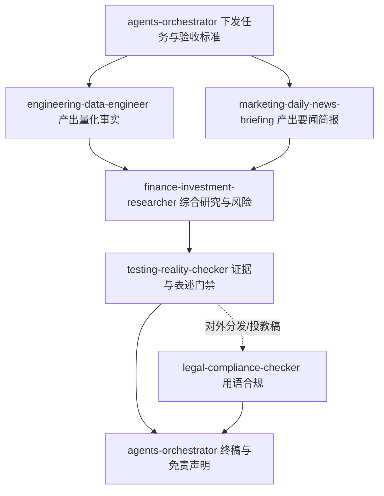

# 国内基金研究流水线（基于 agency-agents-zh 官方智能体）

> **智能体来源**：本项目的 Cursor Subagents **均为** [agency-agents-zh](https://github.com/jnMetaCode/agency-agents-zh) 仓库中的 **原文拷贝**，存放于 `.cursor/agents/`，**不在本仓库内二次撰写人设**。  
> 更新上游：运行 `scripts/sync-agency-agents.ps1`（会浅克隆/拉取并覆盖拷贝选定文件）。  
> **全链路前置**：提示词优化 → 项目经理拆任务 → **智能体编排者**调度；见 **`workflows/agency-operating-model.md`**。  
> **非证券投资咨询**；证据不足处必须标明。

## 运行日目录与 Excel 指标表（必选）

- 流水线开启时创建 **`data/YYYY-MM-DD/`**（运行日）。  
- 最终「基金指标宽表」写入该目录 **`fund_metrics_runs.xlsx`**；同日多次跑批 **按 Sheet 追加**（`Run_001`…）。命令：`cn-fund persist-run --date <运行日> --json <rows.json>`。详见 `workflows/agency-operating-model.md` 第 0 节。

## 本项目选用的官方智能体（文件 → 职责映射）

| `.cursor/agents/` 文件 | 上游路径 | 在本项目中的职责 |
|------------------------|----------|------------------|
| `agents-orchestrator.md` | `specialized/agents-orchestrator.md` | **总编排**：定义阶段、交接上下文、质量循环；终稿汇总与合规提示 |
| `engineering-data-engineer.md` | `engineering/engineering-data-engineer.md` | **量化事实层**：落实可复现数据管线（运行 `cn-fund` / `python -m cn_fund_analysis`，导出结构化业绩事实） |
| `marketing-daily-news-briefing.md` | `marketing/marketing-daily-news-briefing.md` | **公开信息层**：按「每日新闻简报」交付物规范，整理宏观/政策/市场要闻（需联网检索，带来源） |
| `finance-investment-researcher.md` | `finance/finance-investment-researcher.md` | **研究结论层**：在事实+新闻基础上做双面论证、风险情景、可证伪触发条件（公募基金语境） |
| `testing-reality-checker.md` | `testing/testing-reality-checker.md` | **现实检验/质检**：对照证据检查夸大表述、缺失来源、与数据矛盾之处 |
| `legal-compliance-checker.md` | `support/support-legal-compliance-checker.md` | **法务合规（可选）**：面向对外发布或易被误解为投顾的终稿，审查非投顾措辞、宣传与引用边界 |

## 执行顺序（与编排者人格一致：先证据，再结论，再质检）

- **并行**：数据工程师与新闻简报可同时进行；研究仅在两者均有**可引用输出**（或用户明确放弃其一）后启动。
- **法务门禁**：当终稿将对外分发、发帖、投教或任何可能被认定为「投资建议」的渠道发布时，建议在 `testing-reality-checker` 之后、`agents-orchestrator` 终稿收口前，**单独委派** `legal-compliance-checker`；纯内部跑数/内部分析可跳过。

## 交接物约定（项目层契约，非上游 Agent 原文）

便于多轮对话衔接，建议在消息中使用 JSON 代码块传递：

1. **`DATA_FACTS`**：`engineering-data-engineer` 产出 — `commands_run[]`、`as_of`、`candidates[]`、业绩指标（小数形式）、`method_note`（数据来源与未建模项如申赎费）。
2. **`NEWS_BRIEF`**：`marketing-daily-news-briefing` 产出 — 条目含标题、一句话摘要、来源、日期（未知则标 `unknown`）。
3. **`RESEARCH_MEMO`**：`finance-investment-researcher` 产出 — 看多/看空对称、假设、触发失效条件、信心水平。
4. **`REALITY_CHECK`**：`testing-reality-checker` 产出 — 通过/需修订项、证据缺口。
5. **`LEGAL_REVIEW`（可选）**：`legal-compliance-checker` 产出 — 对终稿/外宣稿的合规风险提示、需改写用语清单、保留免责声明建议。

各智能体的**详细交付物格式与语气**以其 `.md` 原文为准；本文件仅固定 **在本仓库内如何分工**。

## 用户触发话术

- 「按 `workflows/agency-operating-model.md` 全链路 + 基金域：主题为 ___，候选代码 ___。」
- 「仅基金域子流程（已由 PM/编排者下发）：按本文件跑 DATA_FACTS ∥ NEWS_BRIEF → RESEARCH_MEMO → REALITY_CHECK。」
- 「跳过新闻，只要 DATA_FACTS + RESEARCH_MEMO + REALITY_CHECK。」
- 「对外发布终稿：在 REALITY_CHECK 后加 LEGAL_REVIEW（`legal-compliance-checker`），再交给编排者收口。」
